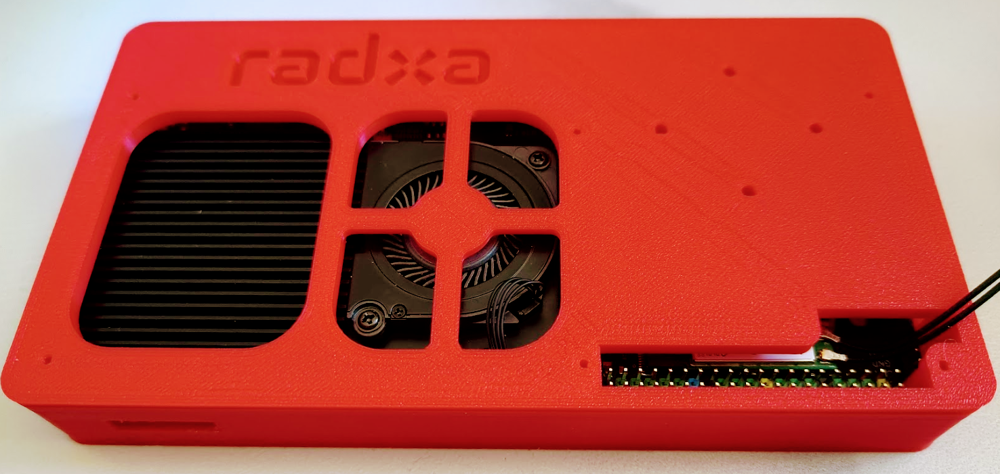
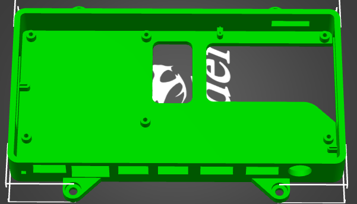
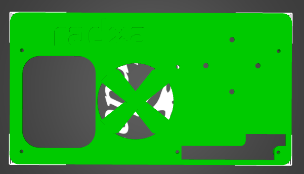
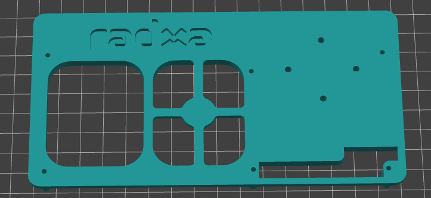

# Radxa-X2L-Case
Radxa X2L 3D printed Cases

The Radxa X2L is a cool little board, but it's a SBC and doesn't come with a case right now (december 2023).

This project is here to propose some 3D printed cases for the Radxa X2L.

The case is designed to be printed in two parts, the top and bottom, except the v0 wich is a single part for the bottom, a way to quick print something to protect the board.

Designers are welcome to propose their own design, and I will add them to the project.

I am not the designer of the cases, I just manage this repo.

Enjoy !

----------

## ChangeLog

----------

### v1.3 2024-02-24

#### bottom 
- with bigger hole for power (was unable to connect to HP USB-C power unit)
- more space to remove the nvme (not sure it is better...)
- VESA 10 pads for screen mount

#### top

- no change to the v1.2 version

### v1.2 2024-15-02

- bottom: more space for nvme
- top: fan protection is Radxa logo
- arc reactor: a box for neopixel ring on the top of the radxa box

### v1.1 2024-01-27 by Cath

#### Top

- Add the Radxa mention to the top
- redisgn the GPIO hole to allow wifi antennas to pass through
- add 4 holes for future suooort of a logo or something else

#### Bottom

- bigger hole for audio jack
- hole for nvme swap without box opening
- reduced the hole for USB-C connector; it was possible to insert the connector in the hole below the USB
- resized the hole for USB ports in the side, more easy to insert the USB connector

### v1.0 2023-01-13 by dasmmt

Top and bottom are now two parts. Designed by dasmmt and offerd to the community here : https://forum.radxa.com/t/x2l-case-or-pcb-3d-model-release-date/19684/2

### v0

This is the first version of the "case":  a single part for the bottom, a way to quick print something to protect the board. Designed by Cath

